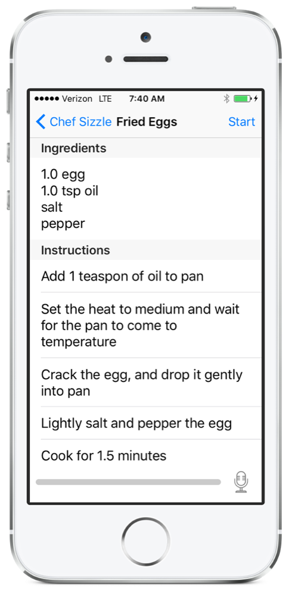

# Sizzle
Hear what's Cooking!

### Summary

...

### General Design Approach

...

### Technical Implementations

##### Frameworks used
Currently, voice recognition is accomplished using the **SFSpeechRecognition** class from Apple's **Speech** framework. Speech synthesis uses the **AVSpeechSynthesizer** class from Apple's **AVFoundation** module

##### Issues and Setbacks

(expand on this) Voice recognition protocol not working as expected. call back error codes undocumented.

### Documentation

[Research Summary](documentation/research.md) - Summary, goals, questions, methodology, scripts, persona results, problem statement, and initial prototype UI.

[Project Proposal](documentation/Proposal.key) - Keynote slides.

### URL's

[Test Flight]() - Not currently available
