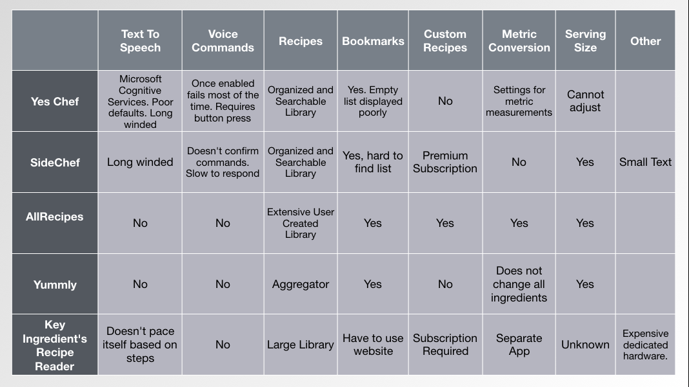
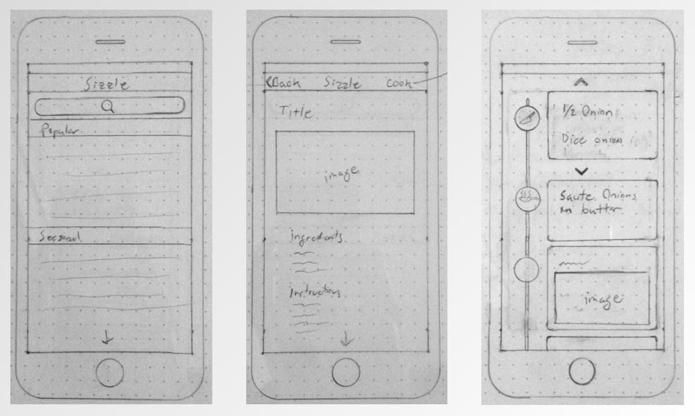

# Research Into Recipe Usage and Needs

## Research Plan
Authors: Josh Fredrickson, jfredric@gmail.com

Date: 11/16/2017

When cooking I use recipes both from books and off my phone and I have always found it difficult to do so without getting either of them dirty. I had a thought that I could remove the need for touch by using voice commands and text to speech. Looking into it there are solutions out there but they all fall sort in either the available recipes, or the stability of the voice features. Most do not even have voice features.

#### Goals

I wish to determine if my theory lines up with other people’s needs and preferences when cooking.

#### Research Questions

1. What the most common source for recipes? Do they use their own, food blogs, cookbooks? Why?
2. What measuring standard do they use/prefer?
3. Do people have issue with touch devices while cooking?
4. Would people use a voice enabled recipe app?
5. What would convince people to switch?
6. Do they own a Google Home, Echo, or plan to get one (including homepod)?
7. Would they want or prefer integration with home devices?
8. Would this improve their cooking?

#### Methodology

1 on 1 Interview
* Recruiting Start Date:
* Study Start Date:
* End Date:

Online Survey
* Study Start Date:
* Recruiting Start Date:
* End Date:

#### Participants

Anyone who cooks and owns a smartphone. No demographic restrictions other than that.

#### Schedule

1 on 1 Interview
Recruiting Start Date:
Study Start Date:
End Date:

#### Script
1. What recipes do people use:
  *  Do you use recipes when you cook and if so where do you get them from?
  * Why?
2. What reasons do people have to using or not using electronics to help them cook:
   * Do you use a phone, tablet or laptop when cooking?
   * How do you use it or why not?
3. What troubles do users have cooking:
 * What issues do you run into when cooking?
4. Do you own any home devices like Google Home, Amazon Echo, or plan to get an Apple Homepod?
  * If so do you use them in the kitchen, and why?

## User Research Results

### Persona 1

#### Personal Details

Name: Blaire

About: Stay at home Dad with 2 kids

#### Stories, Scenarios & Frustrations

Most nights he cooks the same meals that he always does. So much that his family has begun to say “not that again!”

#### Needs/Problems/Goals

He would like to cook something different but doesn’t have the time. Cooking something that he doesn’t know well takes much longer. He is constantly stopping what he is doing so that he can double check what he should be doing. Putting tools down, washing hands, and reading through the recipe to find his place

### Persona 2
#### Personal Details

Name: Stephanie

About: A college student

#### Stories, Scenarios & Frustrations

Growing up her parents always cooked for her. Now she is living on her own for the first time and has to fend for herself.

#### Needs/Problems/Goals

Needs to learn how to cook. Doesn’t know the difference between chopping, dicing, or mincing. What’s he to do with these type of recipe instructions?

## Competitive Analysis

## Problem Statement

Users need a way to know what to do without pausing to look it up because every time they do it increases the time it takes to finish the meal.

Users need help with proper cooking technique and understanding cooking terms because a basic list of instructions is not enough to do something well.

## Hypothesis

We believe that by (doing something, providing solution) for (persona) we will achieve (outcome). We will know this to be true when we see (some feedback criteria)

We believe that by building a hands free interface for users we will make cooking faster. We will know this to be true when we see users not having to put down tools, wash hands, and unlock their phones.

Also we can help users improve their basic cooking skills and knowledge by providing context based responses based on when they ask for details. We will know this to be true when we see user confirmation/feedback or a gradual reduction in a particular users request for details.

## Prototype UI

